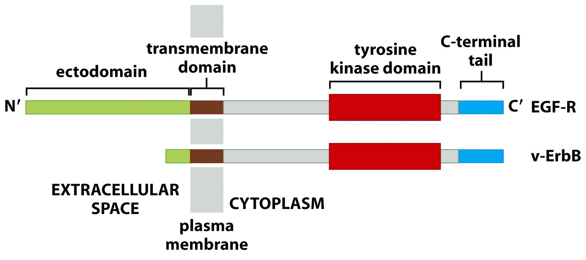

<!-- Limit image width and height -->

<!-- Center image on slide -->

<!-- Italic -->

<!-- Bold -->

--- .segue .dark .nobackground
## Recap

--- 
## Onkogeen
- **Onkogeen** on geen mis võib potentsiaalselt vähki tekitada
- Vähkides on onkogeen muteerunud või ekspresseeritud ebanormaalselt kõrgel tasemel.
- **Proto-onkogeen** on normaalne geen mis võib muutuda onkogeeniks.

--- 
## Onkogeenide aktivatsioon

- **Onkogeenide aktivatsioon** on tingitud geneetilistest mutatsioonidest proto-onkogeenides:
    - Regulatoorsed (protoonkogeeni amplifikatsioon, tuumorsupressorgeeni deletsioon);
    - Struktuursed (mutatsioonid, kromosomaalsed aberratsioonid).
- Sellised mutatsioonid viivad muutusteni protoonkogeeni ekspressioonis või struktuuris. 

--- .segue .dark .nobackground
## Kasvufaktorite-retseptorid

---
## Normaalsed rakkude kasv sõltub rakuvälistest signaalidest

- Need signaalid on vaja ära tunda ja rakku sisse edastada

<footer class="source">Pilt: [The ErbB signalling network](http://www.nature.com/nrm/journal/v2/n2/fig_tab/nrm0201_127a_F1.html).  
</footer>

--- &twocol
## Normaalse koe arhitektuur sõltub erinevate rakutüüpide vaheliste proportsioonide säilimisest

***=left

- Käärsoole epiteel koosneb ühest kihist epiteeli rakkudest (enterotsüüdid) ja moodustab iseloomulikud sõrmjad sopistised all olevasse sidekoesse
- Sõrmjate sopististe põhjas asuvad soole krüptid
- Igas krüptis asuvad tüvirakud
- Rakkude jagunemine toimub ainult krüptis ja diferentseeruvad rakud liiguvad krüptist välja

***=right

<footer class="source">Pildid: üleval, library.med.utah.edu; all, [The Intestinal Crypt, A Prototype Stem Cell Compartment](http://www.sciencedirect.com/science/article/pii/S0092867413008386).   
</footer>

---
## Rakud ei otsusta jagunemist autonoomselt

- Kuigi koekultuuri baassööde sisaldab kõiki elutegevuseks vajalikke toitaineid (aminohapped, vitamiinid, glükoos) ei piisa nende olemasolust, et rakud hakkaksid jagunema
- Vajalikud on ka kasvufaktorid, mida leidub näiteks seerumis

<footer class="source">Pilt: seerumi efekt inimese veresoonerakkude jagunemisele.   
</footer>

---&twocol
## Fibroblastide jagunemine haava paranemisel sõltub vereliistakute poolt vabastatavast kasvufaktorist

***=left
- Vereliistaku $\alpha$-graanulid sisaldavad kasvufaktorit PDGF

***=right

- PDGF retseptor on vajalik fibroblastide PDGF-stimuleeritud migratsiooniks ja jagunemiseks

<footer class="source">Pilt: vasak, [Platelets and the immune continuum](http://www.nature.com/nri/journal/v11/n4/fig_tab/nri2956_F2.html); parem, [Deletion of the PDGFR-β Gene Affects Key Fibroblast Functions Important for Wound Healing](http://www.jbc.org/content/280/10/9375.full).   
</footer>

---
## Onkogeenid võtavad üle kasvukontrolli

<footer class="source">Pilt: Oncogene products are links in signal chains that stretch from the cell surface to the genetic material in the cell nucleus. This chain is composed of (1) growth factors, (2) growth factor receptors, (3) signal transducing proteins in cell membranes, (4) phosphokinases in the cytoplasm and (5) proteins transported from the cytoplasm into the nucleus where they bind to DNA. The localization of different oncogene products (Sis, ErbB, Ras, Src, Myc) is schematically indicated. [Bishop and Varmus, 1989](http://www.nobelprize.org/nobel_prizes/medicine/laureates/1989/press.html)
</footer>

--- .segue .dark .nobackground
## Türosiin-kinaasid signalisatsioonis

--- &twocol
## Src kinaasse aktiivsuse avastamine

***=left

<footer class="source">Proc Natl Acad Sci USA 75:1567, 1978. M. S. Collett and R. L. Erikson: Protein kinase activity associated with the avian sarcoma virus src gene product.</footer>

***=right

- Src oli esimene onkogeen mis avastati.
- Src on selgroogsetel väga konserveerunud valk ja seega mitte eriti immuunogeenne.
- lõpuks siiki v-Src-i ära tundvad antikehad saadi
- Src kinaasne aktiivsus avastati kui tema immuuno-sadestus reaktsiooni lisati $[\gamma^{32}P]$ ATP-d (kahtlustati, et Src võiks olla kinaas).
- Raporteeriti, et Src fosforüleerib treoniine.

---
## Src fosforüleerib türosiine

- Enne Src-i oli teada, et kinaasid fosforüleerivad valkudes seriine ja treoniine.
- 1979. aastal uuris Tony Hunter polüoomiviiruse *middle T* antigeeni ja peale Src-i kinaasse aktiivsuse avastamist tegi ta katse, kas ka middle-T võiks olla kinaas - oli!
- Selgus, et seriini ega treoniini ei fosforüleerita, vaid mingit muud aminohapet, mis osutus hiljem türosiiniks.
- Sama lähenemist kasutades testis ta ka Src-i kinaasset spetsiifilisust.

<footer class="source">The Biology of Cancer (Garland Science 2007)</footer>

--- &twocol
## Src toimib tsütoplasmaatilise türosiin-kinaasina

***=left

- Kinaasne domään (SH1 - *Src homology 1*)
- **SH2**, fosfotürosüül peptiide siduv domään
- **SH3**, proliinirikkaid järjestusi siduv domään
- Alumine pilt, v-src erineb c-src-st C-terminaalse deletsiooni poolest

***=right

<footer class="source">Pilt: Nature reviews in medicine.</footer>

--- &twocol
## Kinaasidel on palju rakulisi substraate

***=left

SRCil kirjeldatud rohkem kui 50 valgulist substraati

***=right

- Src-i aktivatsioon vabastab SH2 ja SH3 domäänid inhibitsioonist ja võimaldab Src-il läbi nende domäänide seostuda teiste valkudega (Src-i substraadid).
- Enamus Src-i substraate on seotud adhesiooni ja migratsiooniga.
- Transformeeriv aktiivsus (stimuleerib rakkude jagunemist) Src-il ilmselt seotud PI3K-Akt aktivatsiooniga.
- Inimesel siiski Src-i mutatsioone (C-terminaalne trunkatsioon) leitud ainult väiksel osal kaugele arenenud soolekasvajatel. Soolekasvajates ei esine ka c-Src-i amplifikatsioone (TCGA).

---
## Kinaaside pleiotroopne toime

- Fosforüleerimine põhjustab substraatidel muutuse funktsionaalses staatuses
- Seriin-treoniin kinaas PKB/Akt reguleerib ellujäämist läbi effektorvalkude aktiveeriva ja inhibeeriva fosforüülimise 

<footer class="source">Pilt: [wikipedia](https://en.wikipedia.org/wiki/Akt/PKB_signaling_pathway)

---
## Esimene retseptor-türosiinkinaas mis avastati oli EGF retseptor

- EGF omas proliferatsiooni stimuleerivat toimet erinevatele epiteliaalset päritolu rakkudele.
- Kuid see toime esines ainult siis kui EGF seostus rakule, viidates rakupinna retseptori olemasolule.
- EGF retseptor isoleeriti emaka epidermoidsest kasvajast kus see oli tugevalt üle-ekspresseeritud. 

<footer class="source">The Biology of Cancer (Garland Science 2007)</footer>

--- &twocol
## Türosiinkinaas retseptorite struktuur

***=left

- Imetajatel ~20 klassi TKR.
- Tsütoplasmaatiline domään on konserveerunud.
- Suur varieeruvus rakuvälises domäänis.

***=right

<footer class="source">Pilt: [themedicalbiochemistrypage.org](http://themedicalbiochemistrypage.org/signal-transduction.php#rtk)

---
## Türosiini kinoom

- Hulkraksete organismide genoomis esindavad türosiin-kinaasid ~10–15% kõigist valgu kinaasi geenidest
- *C. elegans*-il on **90** TK kokku 454 kinaasist, inimestel **90** TK kokku 525 kinaasi geenist
- Inimesel on neist 90 türosiin-kinaasist **58 RTK** (neist neljal puudub kinaasne aktiivsus, nt. ErbB3)
- Enam kui 99% fosfo-aminohapetest on normaalsetes rakkudes fosfo-treoniin ja fosfo-seriin; fosfo-türosiin moodustab 0.05 kuni 0.1% totaalsest fosfo-aminohapetest

--- .segue .dark .nobackground
## RTK onkogeense aktivatsiooni mehhanisme

---
## Muteerunud kasvufaktori retseptor võib toimida onkogeenina

- 1984. aastal avastati, et EGF retseptori (erbB) valgujärestus on homoloogne linnu erütroblastoosi viiruse onkogeeniga v-ErbB.

<footer class="source">The Biology of Cancer (Garland Science 2007)</footer>

**N-terminaalne deletsioon põhustab v-ErbB ligand sõltumatu konstitutiivse aktivatsiooni.**

---
## Mutatsioonid kasvufaktorite retseptorites põhjustavad ligand-sõltumatut aktivatsiooni

<footer class="source">The Biology of Cancer (Garland Science 2007)</footer>

---
## Retseptor türosiin-kinaasid inimese kasvajates

Retseptor | Ligand | Mutatsioon | Vähitüüp
----------|---------|------------|---------
EGFR/ErbB1 | EGF, TGF-a | **üle-ekspressioon** | erinevad kartsinoomid; glioblastoom
EGFR/ErbB1 |  | **ektodomääni deletsioon** | glioblastoom, kopsu- ja rinnakartsinoomid
ErbB2/HER2/Neu | NRG, EGF | **üle-ekspressioon** | 30% rinnakartsinoomidest
ErbB3,4 | erinevad | **üle-ekspressioon** | suuõõne lamerakuline kartsinoom
Flt-3 | Flt3 ligand (FL) | **tandem duplikatsioon** | äge müelogeenne leukeemia
Kit | SCF | **aminohappe asendused** | GI strooma kasvajad
Ret | GDNF | **fuusion, punktmutatsioonid** | kilpnäärme kartsinoomid, endokriinsed neoplaasiad
FGFR3 | FGF | **üle-ekspressioon, ah asendused** | multimüeloom, kusepõie- ja emakakaela kartsinoomid

--- &twocol

## RTK mutatsioonid mao adenokartsinoomides

***=right

- Enamus muutusi RTK-s on seotud koopiaarvu muutustega. 
- Lisaks ka sage VEGFA amplifikatsioon.

***=left

<footer class="source">doi:10.1038/nature13480</footer>

--- &twocol
## Kasvajarakud sekreteerivad autokriinseid kasvufaktoreid

***=left

Kõrval: Rinnanäärme kartsinoomi rakud ekspresseerivad EGF retseptorit (punane) ja selle ligandi $TGF-\alpha$ (roheline).

<footer class="source">The Biology of Cancer (Garland Science 2007)</footer>

***=right

---
# Autokriinsed kasvufaktorid inimese vähkides

Ligand | Retseptor | Vähk
-------|------------|-----
HGF | Met | endokriinsed kasvajad, invasiivsed rinna- ja kopsuvähid, osteosarkoom
IGF2 | IGF-1R | käärsoole kasvajad
IL-6 | IL6R | müeloom, pea-kaela lamerakuline kartsinoom
IL-8 | IL8RA | kusepõie kartsinoom
NRG | HER2/ErbB3 | munasarja kartsinoom
PDGF-BB | PDGFR | osteosarkoom, glioom
PDGF-C | PDGFR | Ewingi sarkoom
PRL (prolaktiin) | PRL-R | rinna kartsinoom
SCF | KIT | Ewingi sarkoom, väikeserakuline kopsu kartsinoom
VEGF-A | VEGFR | neuroblastoom, eesnäärme kasvajad, Kaposi sarkoom
TGF-a | EGFR | lamerakuline kopsuvähk, rinna- ja eesnäärme adenokartsinoom, kõhunäärme kasvaja, mesotelioom
GRP (*gastrin-releasing peptide*) | GRP-R | väikeserakuline kopsu kartsinoom

--- &twocol
## IGF2 amplifikatsioon käärsoole kasvajates

***=left

- IGF2 geeni sisaldav genoomipiirkond 11p15.5 on amplifitseerunud ~7% CRC-s, põhjustades IGF2 üle-ekspressiooni neis vähkides. 
- Lisaks on IGF2 üle ekspresseeritud ka muudel põhjustel. 
- IGF2 või IRS2 (*Insulin receptor substrate 2*) üle-ekspressioon ja PI3K raja mutatsioonid on üksteist välistavad.

***=right

<footer class="source">doi:10.1038/nature11252</footer>

---
## Kaposi sarkoomi rakud sekreteerivad mitmeid erinevaid faktoreid

- Kaposi's sarcomas produce PDGF, TGF-β, IGF-1, angiogenin 2 (Ang2), CCL8, CXCL11, endothelin     and express their receptors. 
- At the same time, the causal agent of this disease, the human herpesvirus-8 (HHV-8) produces vIL-6 and macrophage inflammatory protein (vMIP).

<footer class="source">Pilt: wikipedia </footer>

---- &twocol
## RTK aktivatsoon

***=left

Klassikaliselt toimub see läbi dimeerse ligandi (kasvufaktori) vahendatud retseptori dimerisatsiooni ja sellele järgneva trans-fosforülatsiooni

Näiteks: KIT, VEGFR.

[HER2 aktivatsioon](http://youtu.be/nXtKboH2S38?t=11s)

***=right

--- &twocol

## RTK dimerisatsioon: 4 põhilist moodust

***=right

- TrkA: ligand vahendatud dimerisatsioon, retseptorid oma vahel ei interakteeru.
- KIT: ligand vahendatud dimeer, retseptorid seostuvad omavahel otseselt.
- FGFR: mitmed kontaktid reseptori, ligandi ja hepariini vahel.
- EGFR/ErbB perekond: ligandid indutseerivad retseptori dimerisatsiooni, kuid ise ei interakteeru. 

***=left

---
## EGFR dimerisatsioon

<footer class="source" >Pilt:Structural View of Ligand-Induced Dimerization of the hEGFR ECR[Bessmann et al.](http://www.sciencedirect.com/science/article/pii/S221112471400864X)</footer>

--- 
## RTK kinaasse domääni aktivatsioon

- Kõigi retseptorite kinaasi domäänid (TKD) koosnevad C-terminaalsest ja N-terminaalsest osast ja aktivatsioonilingust
- Aktiveeritud olekus on erinevate retseptorite TKD struktuurid sarnased.
- Inaktiivsed domäänid on aga retseptoritel erinevad, peegldades regulatoorset mitmekesisust
      - autoinhibitsioon läbi aktivatsioonilingu,
      - jukstamembranne autoinhibitsioon,
      - C-terminaalne autoinhibitsioon
- Autoinhibitsioon toimib molekuli siseselt (*cis*)
- Retseptori aktivatsioonil toimub domääni vabastamine autoinhibitoorsest interaktsioonist

---&twocol
## Geenifuusionid põhjustavad konstitutiivselt aktiivsete retseptorite tekke

***=left

- Anaplastic lymphoma kinase (ALK) and c-ros oncogene 1 (ROS1) are related receptor tyrosine kinases (RTKs). 
- ALK and ROS1 have been identified as mutant C-terminal (kinase domain) fusion proteins in research studies of a wide range of human cancers 

***=right

<footer class="source" >Pilt: cellsignal.com</footer>

---
## Lisaks RTK-le on veel palju erinevaid kasvufaktorite retseptoreid-radu

- **Jak perekond** (*just another kinase; Janus kinase*), seostuvad tsütokiini ja kasvufaktorite retseptoritele millel endal puudub kinaasne aktiivsus (kasvuhormooni retseptor, EPO-R, IFN-R).
- **TGF-$\beta$ retseptorid** (NB! seriin-treoniin kinaasse aktiivsusega), aktivatsioon üle tüüp-I (vajab aktivatsiooni) ja tüüp-II (konstitutiivselt aktiivne ser/thr kinaas) retseptorite heterodimeriseerumise.
- **Notch retseptorid**, parakriinse ligandi sidumisel toimub reteptori proteolüütiline aktivatsioon ja Notch ICD (*intracellular domain*) transporditakse tuuma, kus toimib TF-na.
- **Hedgehog signaalirada**, Patched-Smoothened-Gli, basaalrakuline kartsinoom.
- **Wnt signalisatsoon**, Frizzled retseptor, toimib beta-kateniini stabiilsuse ja transkriptsioonilise aktiivsuse kontrollina. Wnt rada on oluliselt häiritud soolekasvajates.

---&twocol
## Janus kinaasi tsütokiini retseptorid

***=left

- Jak perekond, seostuvad tsütokiini ja kasvufaktorite retseptoritele millel endal puudub kinaasne aktiivsus 
- Näited: kasvuhormooni retseptor, EPO-R, IFN-R

***=right
    

<footer class="source">Pilt: nature.com</footer>

---
## TGF-$\beta$ retseptorid

- TGF-$\beta$ retseptorite aktivatsioon toimub üle tüüp-I ja tüüp-II retseptorite heterodimeriseerumise

<footer class="source">Pilt: nature.com</footer>

---&twocol
## Wnt-wingless rada

***=right

- Wnt signalisatsoon toimib läbi Frizzled retseptori
- Wnt ligandid on maatriksiga seotud ja pole vabalt diffuseeruvad
- Rada toimib $\beta$-kateniini stabiilsuse ja transkriptsioonilise aktiivsuse kontrollina
- Wnt rada on oluliselt häiritud soolekasvajates

***=left

<footer class="source">Pilt: nature.com</footer>

---
## Wnt ja TGF-$\beta$ radade mutatsioonid käärsoole kasvajates

- Wnt raja retseptor **Frizzled (FZD10)** ~30% juhtudest üle-ekspresseeritud. 
- **TGF-beta ja Aktiviini** retseptorid muteeritud vastavalt 60% ja 80% juhtudest.

<footer class="source">doi:10.1038/nature11252</footer>

---&twocol
## Notch signaalirada

***=left

- Notch retseptorile parakriinse ligandi (Delta/Jagged) sidumisel toimub reteptori proteolüütiline aktivatsioon $\gamma$-sekretaaside poolt
- Notch rakusisene domeen (ICD) transporditakse tuuma, kus toimib TF-na koos koaktivaatoritega
- Ligand-sõltumatu konstitutiivselt aktiivne Notch signalisasioon toimub u. pooltes T-raku leukeemiates

***=right

---&twocol
## Hedgehog signaalirada

***=left

***=right

- Imetajatel: Patched-Smoothened-Gli 
- Ptc ja Smo mutatsioonid esinevad basaalrakulises kartsinoomis
- Ptc mutatsioonid medulloblastoomides

---.segue .dark .nobackground
## Rakuvälise maatriksi retseptorid

--- &twocol
## Integriinid

***=left

<footer class="source">doi:10.1038/nrm1229</footer>

***=right

- Rakuvälise maatriksi (**ECM**) retseptorid.
- Heterodimeerid: 18 $\alpha$- ja  8 $\beta$ -subühikut.
- Rakkude **adhesioon**, **migratsioon**, **anoikis**.
- Integriinide tsütoplasmaatilised sabad seovad mitmeid valke, nt. **taliin, vinkuliin, $\alpha$-aktiniin**, mis seostuvad aktiini tsütoskeletile ja seeläbi vahendavad kõiki integriini rakulisi funtsioone.
- **Seest-välja (*inside-out*) signalisatsioon** reguleerib integriini afiinsust,
    - integriini subühikute tsütoplasma sabade vaheline interaktsioon takistab aktivatsiooni.

---
## $\alpha$- ja  $\beta$-subühikute kombinatsioonid tagavad spetsiifilisuse

<footer class="source">doi:10.1186/gb-2007-8-5-215</footer>

---
## Integriinide ECM ligandid

Integriin | ECM ligand
----------|-----------
$\alpha 1\beta 1$ | kollageen, laminiin, vitronektiin, fibronektiin
$\alpha v\beta 3$ | vitronektiin, fibrinogeen, trombospondiin (angiogenees)
$\alpha 5\beta 1$ | fibronektiin
$\alpha 6\beta 1$ | laminiin
$\alpha 7\beta 1$ | laminiin
$\alpha 2\beta 3$ | fibrinogeen
$\alpha 6\beta 4$ | laminiin (epiteliaalsed hemidesmosoomid)

[Ligand-binding specificities of human integrins](http://genomebiology.com/2007/8/5/215/table/T2)

---&twocol
## Integriinid organiseerivad raku adhesioonid

Rakkude adhesioonid on multivalk kompleksid millel on mehhaanilised ja signaali üle kandvad funktsioonid.

***=left

***=right

---&twocol
## $\beta 1$-integriin vähi arengus

***=left

- $\beta 1$-integriin on hiire rinnavähi mudelis vajalik  kasvaja tekkes ja hilisemas faasis vähirakkude jagunemisvõime säilitamiseks. *Ablation of β1-integrin expression impairs mammary tumorigenesis in MMTV/PyV MT mice*, [doi:10.1016/j.ccr.2004.06.025](http://www.sciencedirect.com/science/article/pii/S1535610804002077) (kõrval olev pilt).

- Inimese vähkides on β1 integriinid üle ekspresseeritud nt. pea-kaela lamerakulises kartsinoomis (*HNSCC*) ja määrab kasvajarakkude resistentsuse radioteraapiale, [doi:10.1172/JCI61350](http://www.jci.org/articles/view/61350).

***=right

--- &twocol
## GPCR

***=right

- **G-valgulised retseptorid** (genoomis 800 geeni). 
- Mitogeenid nagu trombiin, lüsofosfatiid hape (LPA), gastrin-releasing peptide (GRP), endoteliin ja prostaglandiinid stimuleerivad rakkude jagunemist läbi oma spetsiifiliste GPCR-ide. 
- Munasarja vähi astsiit sisaldab palju LPA-d ja stimuleerib rakkude jagunemist ja kemoresistentsust.
- G valgu kompleks ($\alpha$, $\beta$ ja $\gamma$ subühikud) aktiveerub seostudes retseptorile 

***=left

<footer class="source">doi:10.1038/nrm2299</footer>

--- .segue .dark .nobackground

## Lingid teistele loengutele

--- &twocol 

***=left 

- [Sissejuhatav loeng](http://tpall.github.io/sissejuhatus)
- [Vähitüübid](http://tpall.github.io/Vahityybid)
- [Onkoviirused](http://tpall.github.io/Onkoviirused)
- [Onkogeenid](http://tpall.github.io/Onkogeenid)
- [Retseptorid](http://tpall.github.io/Retseptorid)
- [Signaalirajad](http://tpall.github.io/Signaalirajad)
- [Tuumorsupressorgeenid](http://tpall.github.io/Tuumorsupressorid)
- [Rakutsüklikontroll](http://tpall.github.io/Rakutsyklikontroll)

***=right 

- [p53 ja apoptoos](http://tpall.github.io/p53-ja-apoptoos)
- [Immortalisatsioon](http://tpall.github.io/Immortalisatsioon)
- [Tumorigenees](http://tpall.github.io/Tumorigenees)
- [Genoomiterviklikkus](http://tpall.github.io/Genoomiterviklikkus)
- [Mikrokeskkond](http://tpall.github.io/Mikrokeskkond)
- [Metastaasid](http://tpall.github.io/Metastaas)
- [Immuunsus](http://tpall.github.io/Immuunsus)
- [Vähiravimid](http://tpall.github.io/Vahiravim)
